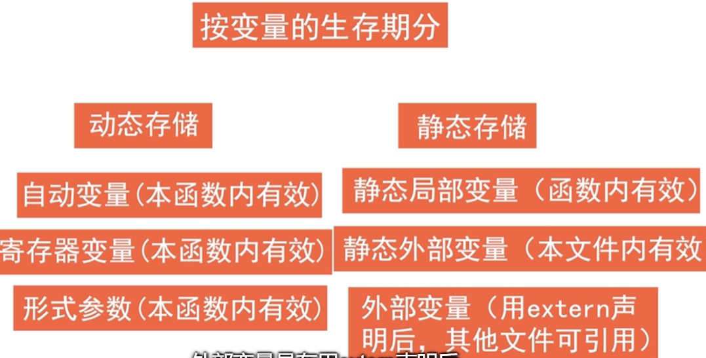
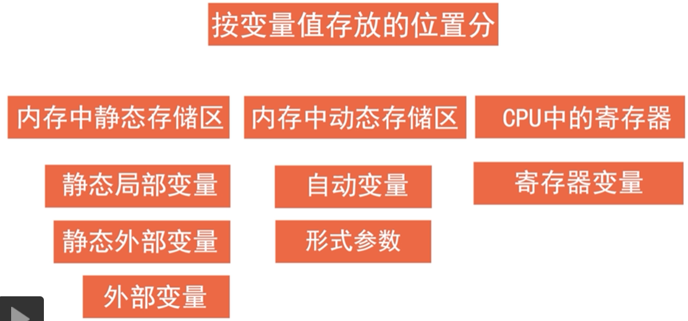

全局变量和局部变量：根据变量的作用域不同，分为局部变量和全局变量（外部变量）。

用户的内存空间分为三部分，程序区、静态存储区、动态存储区（分为堆和栈）。

> 全局变量

都位于静态存储区
可以被多个函数所调用。
生存周期为整个程序运行过程，程序开始时分配存储空间，程序结束后释放存储空间。

第一种，非静态全局变量。
作用域为定义处到文件末尾。
```cpp
#include<stdio.h>
int a;
int main(){return 0;}
```

PS：extern关键字。
向上扩展本文件的全局变量作用域到这行；扩展其他文件的全局变量作用域到本文件。
```
#include<stdio.h>
extern a;
int main(){return 0;}
int a;
```

第二种，静态全局变量。static关键字。
限制只允许本文件使用的作用域。
```cpp
#include<stdio.h>
static int a;
int main(){return 0;}
```


> 局部变量

第一种，自动变量（动态局部变量）。
默认，关键字auto。`auto int a;`，即`int a;`。
位于内存的动态存储区。
局部变量，调用函数时分配存储空间，调用结束后释放存储空间。
分三类，函数的形式参数，函数中定义的变量，函数内的复合语句内定义的变量。
每次在调用函数时重新赋初始值。


第二种，静态局部变量。
关键字static。`static int a;`
位于内存的静态存储区。
在编译时赋初始值，每次调用函数时不再重新赋值。
数值型静态局部变量，默认赋值0，字符型赋值`\0`。
和全局变量的区别，虽然在函数结束调用后依然存在，但只能被本函数所使用，不能被其他函数使用。

第三种，寄存器变量。
关键字register。`register int a;`
位于CPU寄存器中。






---


> 以下叙述正确的是(B)
A.全局变量的作用域一定比局部变量的作用域作用范围大
B.静态static类型变量的生存期贯穿于整个程序的运行范围
C.未在定义语句中赋初值的auto变量和static变量的初值都是随机值
D.函数的形参都属于全局变量

解析：
A：如果同一个源文件中，只有一个主函数,外部变量与局部变量同名，则在局部变量的作用范围内，外部变量被“屏蔽”
C：static默认是0或'\0'.


> 关于操作系统heap与stack说法中，正确的是（）。
正确答案: B C   你的答案: A B C (错误)
A.stack由编译器自动分配和释放,存放函数的参数值，局部变量，全局变量的值
B.heap一般由程序员分配和释放，若程序员不释放，可能会造成操作系统的内存泄露
C.stack由系统自动分配，无需程序员干涉，heap需要手动申请
D.heap与stack都会在初始大小空间用满时，系统自动增加其大小

解析：
全局变量放在static静态区


# 全局变量和局部变量的区别是什么?


第一，划分依据？
根据变量的作用域不同，分为局部变量和全局变量。全局变量的作用域为程序块，而局部变量的作用域为当前函数。

第二，内存存储方式有什么不同？

全局变量分为，静态全局变量和非静态全局变量，都分配在内存的静态存储空间。
局部变量有三种，自动变量分配在内存的动态存储区，静态局部变量分配在内存的静态存储区，寄存器变量分配在CPU寄存器中。

第三，生命周期有什么不同？

全局变量随主程序创建而创建，随主程序销毁而销毁，
局部变量在局部函数内部，退出就不存在了。静态局部变量另说。

第四，使用方式不同？

通过声明为全局变量，程序的各个部分都可以用到。
而局部变量只能在局部使用。


# 局部变量能否和全局变量重名？

能，局部会屏蔽全局。在函数内引用这个变量时，会用到同名的局部变量，而不会用到全局变量。

# 同名的全局变量可不可以定义在可被多个.C文件包含的头文件中？为什么？

可以，在不同的C文件中声明为静态全局变量，限定本文件使用。

但前提是其中只能有一个C文件中对此变量赋初值，此时连接不会出错。
